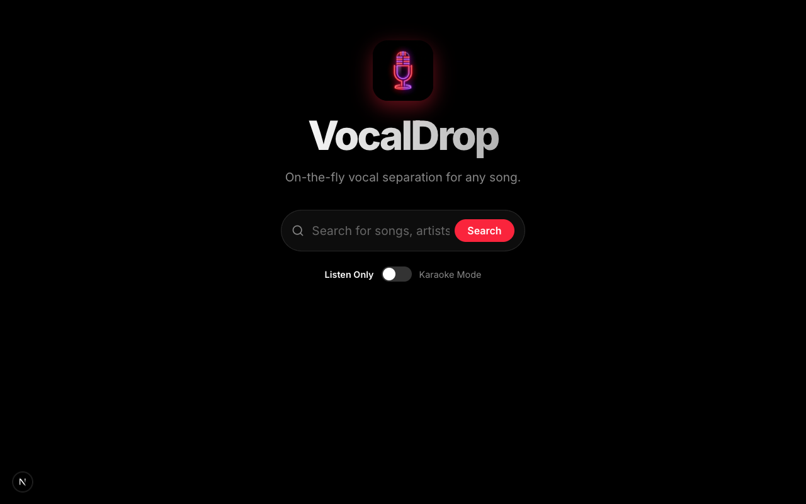
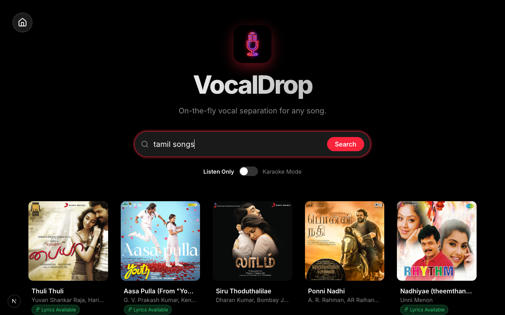
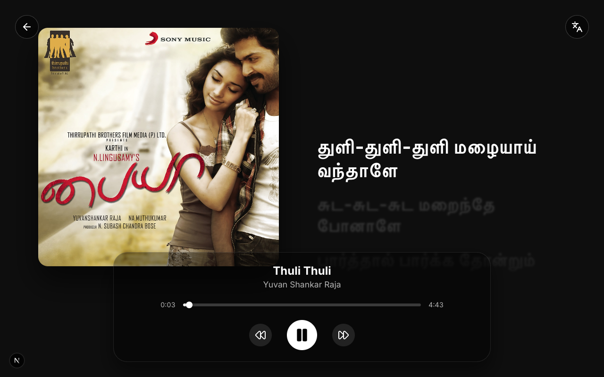
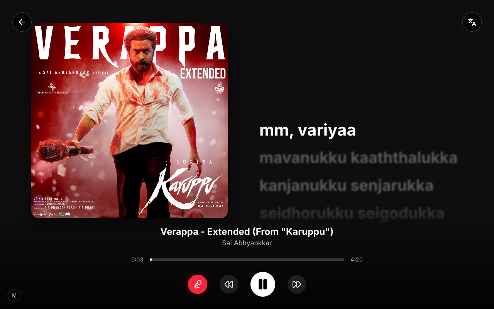
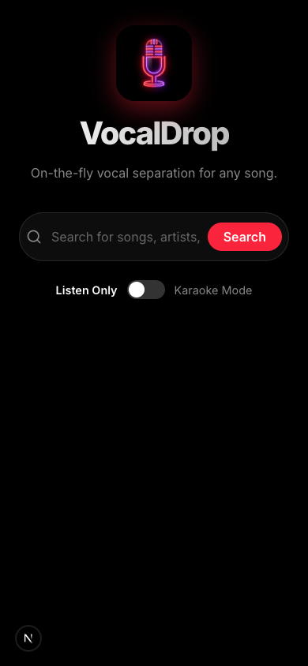
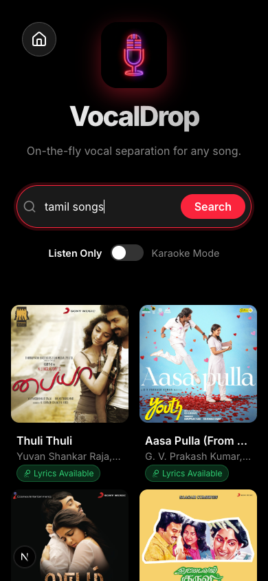
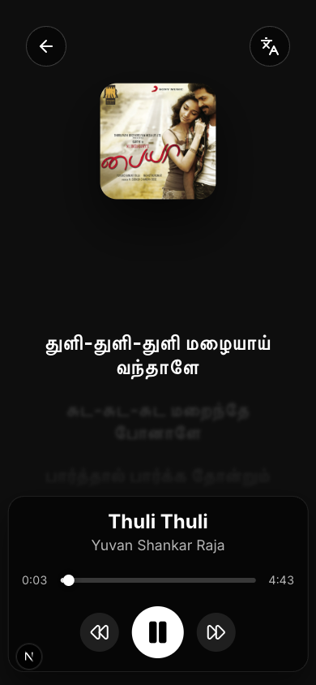
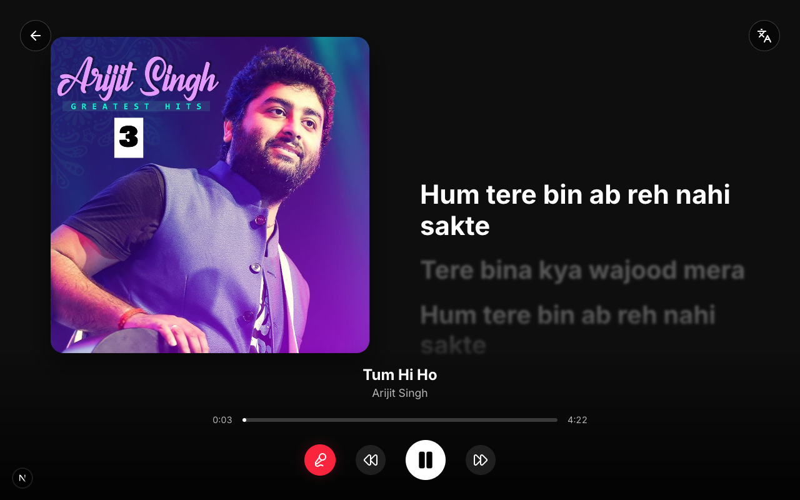
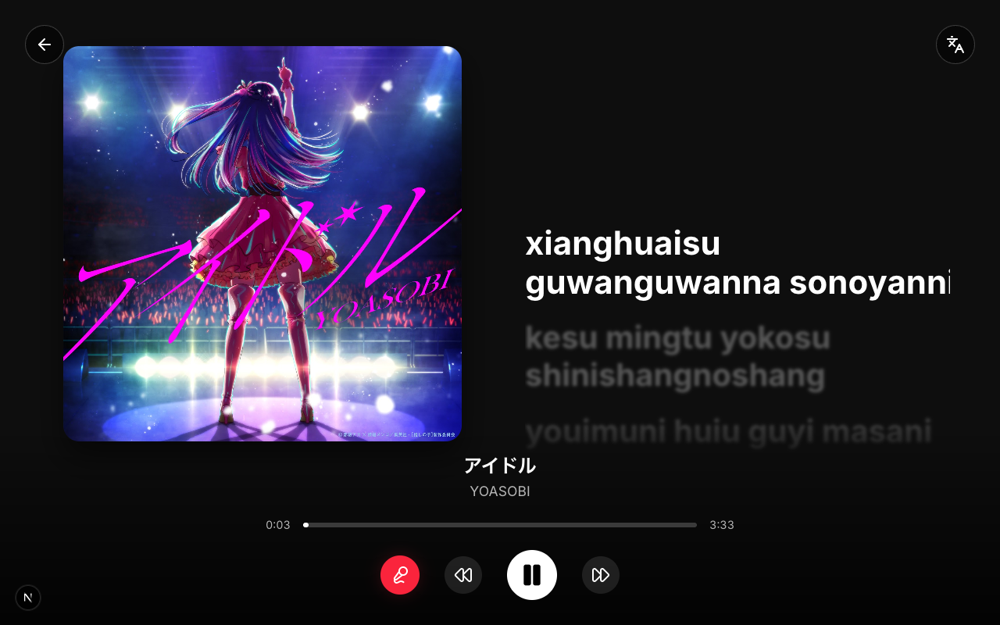
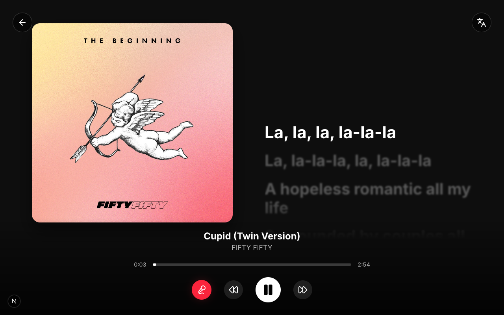

# VocalDrop 🎤

<p align="center">
  
</p>

<p align="center">
  <em>An open-source, AI-powered karaoke platform and ad-free music player built on top of YouTube Music.</em>
</p>

<p align="center">
  <a href="#features">Features</a> •
  <a href="#system-requirements">Requirements</a> •
  <a href="#running-the-app">Installation</a> •
  <a href="#%EF%B8%8F-karaoke-recording-studio">Recording Studio</a>
</p>

**VocalDrop** is a full-stack Next.js and FastAPI application that transforms any song into a studio-grade karaoke track on-the-fly. Using state-of-the-art AI vocal separation (UVR5 / MDX-Net) and precise synced lyrics, it offers a completely ad-free music streaming experience.

**Cultural Origins:** While the application natively supports and intelligently romanizes dozens of global languages (from Hindi to Korean), it was originally crafted with a deep love for Tamil music. Special care was taken to ensure that Tamil lyrics are transliterated beautifully and phonetically for non-native readers.

---

## System Requirements

Due to on-the-fly AI vocal separation, your system hardware will directly impact how quickly karaoke tracks are prepared.

**Minimum Requirements**
- **CPU**: Dual-core processor (Intel i3 / AMD Ryzen 3 or equivalent)
- **RAM**: 4 GB
- **Storage**: 2 GB of free space (for caching downloaded ML models and audio tracks)
- **Performance**: AI vocal separation will run on CPU and take roughly **30 to 60 seconds** to prepare a song.

**Recommended Specs** (For the best experience)
- **CPU / ML Acceleration**: Apple Silicon (M1/M2/M3) or a dedicated NVIDIA GPU (CUDA-compatible)
- **RAM**: 8 GB+
- **Storage**: SSD (Solid State Drive)
- **Performance**: AI vocal separation is hardware-accelerated, taking only **5 to 10 seconds** to prepare a song.

---

## Prerequisites

Before running the application, ensure you have the following installed on your system:
- **Node.js** (v18 or higher)
- **Python** (v3.10 or higher)
- **FFmpeg** (Required by `audio-separator` and `yt-dlp` for audio processing)
  - **Mac:** `brew install ffmpeg`
  - **Windows:** Download from [gyan.dev](https://www.gyan.dev/ffmpeg/builds/) or use `winget install ffmpeg`
  - **Linux:** `sudo apt install ffmpeg`

---

## 1. Setting up the Backend

The backend is built with FastAPI, `yt-dlp` for fetching audio, `audio-separator` (UVR) for vocal isolation, and `syncedlyrics` for lyrics fetching. It utilizes the highly-optimized **UVR-MDX-NET-Inst_full_292 VIP** model (a state-of-the-art MDX-Net architecture) to eliminate vocal bleed. Audio is processed dynamically in **rapid 10-second chunks**, enabling near-instant karaoke playback without hardware bottlenecking or stuttering! Additionally, an intelligent 15-second inactivity heartbeat automatically terminates background ML processes if you leave the page, ensuring 0% CPU footprint when idle.

1. Navigate to the backend directory:
   ```bash
   cd backend
   ```

2. Create a Python virtual environment (recommended):
   ```bash
   python -m venv venv
   source venv/bin/activate  # On Windows: venv\Scripts\activate
   ```

3. Install the dependencies:
   ```bash
   pip install fastapi uvicorn yt-dlp ytmusicapi syncedlyrics audio-separator tamil-translite uroman
   ```
   *(Note: The backend automatically utilizes PyTorch for the AI separation models).*

4. Start the backend server:
   ```bash
   python main.py
   # Or using uvicorn directly: uvicorn main:app --host 0.0.0.0 --port 8000 --reload
   ```

The backend API will now be running at `http://localhost:8000`.

---

## 2. Setting up the Frontend

The frontend is a modern React application built with Next.js (App Router).

1. Open a new terminal window and navigate to the frontend directory:
   ```bash
   cd frontend
   ```

2. Install the Node modules:
   ```bash
   npm install
   ```

3. Start the Next.js development server:
   ```bash
   npm run dev
   ```

The frontend will now be accessible at `http://localhost:3000`.

---

## Running the App

You can choose to run the app natively on your machine (for the fastest vocal separation), or via Docker (which natively enables Wi-Fi access on your local network).

### Option A: Standard Deployment (Recommended for Speed)
You can run both the frontend and backend servers automatically by clicking the **Karaoke Automator App** included in the project folder. This will silently launch both servers and open the app in your browser.

Alternatively, you can run them manually:
1. Start the FastAPI backend: `cd backend && source venv/bin/activate && python main.py`
2. Start the Next.js frontend: `cd frontend && npm run dev`
3. Open your browser and go to `http://localhost:3000`
### Hardware & Platform Compatibility Matrix
Docker handles hardware acceleration differently depending on your operating system. Please read this before choosing your Docker deployment option:

- **Apple Silicon (M1/M2/M3) & Mac Intel:** Docker on macOS runs inside a Linux Virtual Machine. It **cannot** access Apple's Neural Engine or Metal GPU. You must use **Option B (CPU)**. For hardware-accelerated speeds, use the native **Option A**.
- **Windows / Linux (with NVIDIA GPU):** Docker fully supports NVIDIA GPU passthrough. You can use **Option C (NVIDIA GPU)** for blazing-fast performance.
- **Windows / Linux (Intel/AMD Integrated Graphics or AMD GPU):** Docker does not easily support passing these through to `onnxruntime`. You should use **Option B (CPU)**.

### Option B: Docker Deployment - Standard CPU (Best for Mac/Mobile Access)
Running via Docker uses a production Next.js build, which automatically allows any device on your local Wi-Fi to connect (bypassing strict dev-mode origin policies).

*Note: Docker on Mac/Windows primarily uses your CPU for AI vocal separation due to VM hardware limitations. If you have Apple Silicon, Option A will separate vocals much faster natively (5s vs 30s).*

**⚠️ Important Docker Hardware Settings:**
To prevent Karaoke mode from stopping or stuttering inside Docker, you must allocate sufficient CPU and Memory to the Docker Virtual Machine. Open **Docker Desktop Settings -> Resources** and set:
- **CPU limit:** `8` or `10` (the more cores, the faster the AI separation).
- **Memory limit:** `16 GB` (prevent the AI from swapping and stalling).

1. Ensure you have Docker installed and running with the above resources.
2. In the project root, run:
   ```bash
   docker-compose up --build
   ```
3. Open your browser and go to `http://localhost:3000`.

### Option C: Docker Deployment - NVIDIA GPU (For Windows/Linux with dedicated GPUs)
If you have an NVIDIA GPU and want blazing-fast hardware-accelerated separation inside Docker:

1. Ensure you have the [NVIDIA Container Toolkit](https://docs.nvidia.com/datacenter/cloud-native/container-toolkit/latest/install-guide.html) installed.
2. In the project root, run the dedicated GPU configuration:
   ```bash
   docker-compose -f docker-compose.gpu.yml up --build
   ```
3. Open your browser and go to `http://localhost:3000`.

**To access on your phone (Option B & C):** Connect your phone to the same Wi-Fi network, find your computer's local IP address (e.g., `192.168.1.50`), and navigate to `http://192.168.1.50:3000` in your mobile browser!

> [!TIP]
> **📱 Pro-Tip for Mobile Users (App-like Experience):**
> For the absolute best UI experience on your phone (fullscreen, native look, hiding the browser UI):
> - **iPhone/iPad (Safari):** Tap the **Share** button at the bottom and select **"Add to Home Screen"**.
> - **Android (Chrome):** Tap the **3-dot menu** in the top right and select **"Add to Home screen"**.
> 
> You can then launch "Sing It Your Way" directly from your home screen just like a native app!

---

## Accessing from other devices (Option A)

If you chose the Standard Deployment (Option A) and want to use the app from your phone on your local Wi-Fi network:
1. Find your computer's local IP address (e.g., `192.168.1.50`).
2. Open `frontend/next.config.js` and add your IP address to the `allowedDevOrigins` array to allow Next.js to serve the page over the network.
3. Start the application (using the Automator App or starting the frontend with `npm run dev -- -H 0.0.0.0`).
4. Open `http://YOUR_LOCAL_IP:3000` on your phone's browser.
*(Ensure your firewall allows connections on ports 3000 and 8000).*

---

## 🎙️ Karaoke Recording Studio

VocalDrop features an advanced, entirely in-browser **Karaoke Recording Studio** that allows you to record your own covers perfectly synced with the high-quality isolated instrumental tracks! It utilizes the Web Audio API to mix your live microphone feed with studio-grade effects in real-time. The studio interface is highly responsive, featuring fluid typography that adapts beautifully to any screen size, and dynamically replaces the album art with a beautiful live video feed of yourself while recording!

**How it Works:**
1. Find a song and click the **Karaoke** toggle to generate the instrumental stems.
2. **Dynamic Audio Visualizer:** As the track plays, a beautiful real-time audio visualizer dynamically bounces and reacts to the isolated stems (or your live microphone feed when recording), tinting itself with the vibrant colors of the album art using advanced canvas composite blending.
3. **Real-Time Pitch Correction (Key Shifter):** Click the **Adjust Pitch** slider icon in the bottom player bar to shift the backing track's key up or down by up to 6 semitones (in 0.1 increments) using our custom Granular Synthesis Web Audio engine. The shifted track is routed perfectly into your final recording without artifacts or tempo fluctuation!
3. If Romanized lyrics are available for the song's language, a **Translate/Language button** will appear in the top right corner. Click it to seamlessly toggle between the native script and the English phonetics!
3. Click the **Record Cover** button located in the bottom player bar to open the Studio Popup.
3. Choose your settings in the Studio:
   - **Mic / Camera Selection:** Pick exactly which microphone and webcam to use.
   - **Mic Input Delay Compensation:** Fix hardware latency by aligning your recorded voice perfectly with the music (defaults to `80ms`).
   - **Camera Video Delay:** Delays the entire audio mix to wait for your camera video if it is lagging behind (defaults to `0ms`).
   - **Video Aspect Ratio:** Choose between Auto-detect, Portrait (9:16), or Landscape (4:3). *Note: The Landscape option enforces a 4:3 ratio (`3840x2880`) to bypass macOS Continuity Camera's default 1080p clamping, unlocking full native 4K+ sensor resolution!*
   - **Microphone Volume:** Boost your voice up to 400% to ensure you cut through loud instrumental mixes (defaults to `70%`).
   - **Studio Reverb:** Add synthetic acoustic depth (wetness) to your voice (defaults to `5%`).
   - **Intelligent Ducking:** Automatically drops the instrumental backing track down to 50% volume in the final recording, carving out a massive pocket for your vocals to sit front-and-center.
4. Choose between **Voice Only** or **Voice + Video** (requires Camera permissions).
5. Sing along! The app mixes your voice and the music synchronously. **Pro-Tip:** You can toggle the Karaoke button off at any time during a recording to bring the original vocals back in (e.g., to let the original artist sing the chorus) without stopping your recording!
6. When finished (or when you leave the page / explicitly click the Stop Record button), the recording will stop, and a perfectly mixed **320kbps Studio Quality** `.webm` media file will instantly download directly to your device!

**Best Practices & Limitations:**
- **Use Wired Headphones:** Due to the physical nature of Bluetooth, wireless headphones introduce an unavoidable audio delay (latency) between when you speak and when the computer registers it. For perfectly synced recordings where your voice matches the beat, **always use wired headphones**.
- **Secure Contexts & Local Network Access:** Modern browsers (iOS Safari, Android Chrome, and Desktop Chrome) forcefully block microphone and camera access unless the website is loaded over a secure HTTPS connection or `localhost`. If you are accessing VocalDrop on another device over your local Wi-Fi via an IP address (e.g., `http://192.168.x.x:3000`), the recording feature **will be blocked**. To bypass this for local testing:
  - **Option A (Fastest - Chrome Users):** Open Chrome on the secondary device, navigate to `chrome://flags/#unsafely-treat-insecure-origin-as-secure`, enable the flag, and add your exact URL (e.g., `http://192.168.x.x:3000`) to the text box. Relaunch Chrome.
  - **Option B (Universal - ngrok):** Run a local tunnel like `ngrok http 3000` on your main computer. This generates a secure `https://[random].ngrok.app` link that you can open on any device (including iPhones) to grant full microphone/camera access.

---

## Screenshots & Features

<details>
<summary><strong>🖥️ Desktop Experience</strong> <i>(Click to expand)</i></summary>
<br>
<p align="center">
  
  
  
</p>
<p align="center">
  
  
  
</p>
</details>

<details>
<summary><strong>📱 Mobile Experience</strong> <i>(Click to expand)</i></summary>
<br>
<p align="center">
  
  
  
</p>
</details>

<details>
<summary><strong>🌍 Global Language Romanization Support</strong> <i>(Click to expand)</i></summary>
<br>
<p align="center">
  
  
  
</p>
</details>

---

## Credits & Open Source Acknowledgements

This project is made possible thanks to several incredible open-source projects and libraries:

- **[yt-dlp](https://github.com/yt-dlp/yt-dlp)**: For fast and reliable audio extraction.
- **[ytmusicapi](https://github.com/sigma67/ytmusicapi)**: For powering the seamless music search experience.
- **[audio-separator](https://github.com/nomadkaraoke/python-audio-separator)**: For the core vocal isolation capabilities, built upon robust architectures like Demucs and MDX-Net.
- **[syncedlyrics](https://github.com/rtcq/syncedlyrics)**: For providing accurate LRC timed lyrics from multiple providers (e.g., Musixmatch, LrcLib).
- **[pydub](https://github.com/jiaaro/pydub)**: For high-performance audio chunking and processing.
- **[tamil-translite](https://github.com/ashok-ramachandran/tamil-translite)**: For transliterating Tamil lyrics to English characters on-the-fly.
- **[uroman](https://github.com/isi-nlp/uroman)**: For universal Romanization of lyrics across Hindi, Korean, Japanese, Russian, and many other popular languages.
- **[FastAPI](https://fastapi.tiangolo.com/)** & **[Uvicorn](https://www.uvicorn.org/)**: For the robust, asynchronous Python backend API.
- **[Next.js](https://nextjs.org/)** & **[React](https://react.dev/)**: For the dynamic, responsive frontend UI and state management.
- **[Framer Motion](https://www.framer.com/motion/)**: For the fluid, spring-physics driven lyrics animations and responsive UI scaling.
- **[Lucide](https://lucide.dev/)**: For the clean and consistent UI icons.

---

## Disclaimer & Fair Use (Legal Notice)

**Proof of Concept & Educational Use Only:** VocalDrop is an open-source proof-of-concept project built strictly for personal, educational, and research purposes. 

- **No Hosting:** The creator(s) of this repository do not host, store, or distribute any copyrighted audio, lyrics, or video files. 
- **Third-Party APIs:** All audio streams and metadata are dynamically fetched in real-time from third-party public platforms (like YouTube Music). 
- **AI Models:** The vocal separation utilizes open-source AI models (UVR5). Please verify the licensing of the specific ML models if you intend to fork this project.
- **Responsibility:** Users are strictly responsible for how they use this software and must ensure they comply with the Terms of Service of any respective third-party platforms (including YouTube and lyrics providers). This software is absolutely not intended, nor should it ever be used, to pirate or commercially distribute copyrighted material.
